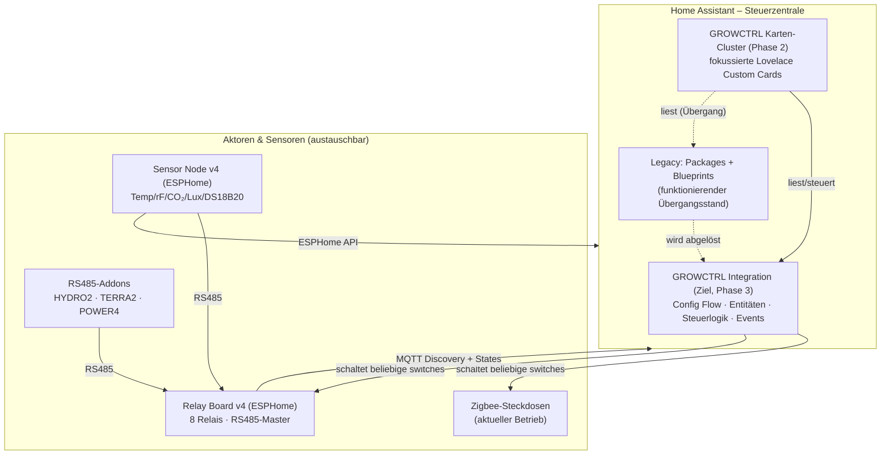

<p align="center">
  
</p>

# GROWCTRL

**Home-Assistant-Gesamtsystem zur Automatisierung von Growzelten (Hydroponik & Erde).**

> Version 2.0.0-dev · Lizenz: MIT
> Entwickelt von **MrDarkvoid** in Zusammenarbeit mit **Claude (Anthropic)** – Vibe Coding

---

## Was ist GROWCTRL?

GROWCTRL steuert Licht, Pumpen, O₂, Umluft und Klima beliebig vieler Growzelte vollständig
über Home Assistant. **HA ist die Steuerzentrale** – die eigentliche Logik (Lichtzeiten mit
Mitternachtsüberlauf, Pumpenzyklen je Wachstumsphase, Klima-Hysterese, Failsafes,
Manual-Override) läuft in HA.

Aktoren und Sensoren sind **hardware-agnostisch**:

| Ebene | Heute | Optional |
|---|---|---|
| Aktoren | Zigbee-Steckdosen (beliebige HA-Switches) | GROWCTRL Relay Board (ESPHome, 8 Relais) |
| Sensorik | Beliebige HA-Sensoren | GROWCTRL Sensor Node + RS485-Addons (HYDRO2/TERRA2/POWER4) |

Die eigene Hardware (siehe `/firmware`) ist ein **verlängerter Arm**: Sie schaltet, misst und
kalibriert lokal – gesteuert wird sie von HA, ihre Messwerte fließen zurück nach HA.

## Architektur



## Repository-Struktur

```
growctrl/
├── assets/                  Logo & Grafiken
├── cards/                   Karten-Cluster (Phase 2) – fokussierte Custom Cards + core-Bibliothek
├── custom_components/
│   └── growctrl/            Die GROWCTRL-Integration (Phase 3) – ersetzt Packages & Blueprints
├── docs/                    Architektur, Log-Referenz, Entitäten-Liste, Bestandsaufnahme
├── firmware/                Optionale ESPHome-Hardware (Relay Board, Sensor Node)
├── legacy/                  Heutiger funktionierender Stand (Packages, Blueprints, Dashboard)
│   ├── packages/
│   ├── blueprints/
│   └── dashboard/
├── CHANGELOG.md · CONTRIBUTING.md · LICENSE · README.md
```

## Installation

### Integration (HACS, empfohlen)
1. HACS → ⋮ → **Benutzerdefinierte Repositories** → `MrDarkvoid/growctrl`, Kategorie **Integration**
2. „GROWCTRL" installieren, HA neu starten
3. Einstellungen → Geräte & Dienste → **Integration hinzufügen → GROWCTRL** → je Station einen Eintrag anlegen
   (Zelt-/Stationsname, Licht-Switches Pflicht, Pumpe/O₂/Umluft optional)

### Karten (HACS)
1. HACS → ⋮ → **Benutzerdefinierte Repositories** → `MrDarkvoid/growctrl-cards`, Kategorie **Dashboard**
2. „GROWCTRL Cards" installieren – Ressource wird automatisch registriert
3. Karten im Dashboard hinzufügen – **alle 6 Karten haben einen vollständigen GUI-Editor**
   (Beispiele: `cards/examples/`, manueller Test ohne HACS: `cards/examples/INSTALLATION_TEST.md`)

### Legacy-Weg (Übergangsstand)
Packages aus `legacy/packages/` + Blueprints aus `legacy/blueprints/` wie bisher; Details in `legacy/README.md`.

### ⚠️ Integration lässt sich nicht installieren? (Checkliste)

1. **Repo-Struktur prüfen (häufigste Ursache):** Im GitHub-Repo `MrDarkvoid/growctrl` müssen `README.md`,
   `hacs.json` und `custom_components/` **direkt im Repo-Root** liegen. Wenn das ZIP mit seinem
   Wrapper-Ordner hochgeladen wurde (`growctrl/custom_components/...` im Repo), findet HACS nichts →
   Inhalt des entpackten `growctrl/`-Ordners in den Repo-Root verschieben.
2. **Release anlegen:** Auf GitHub ein Release `v2.1.0` taggen – HACS bevorzugt Releases gegenüber `main`.
3. **Lokale Installation als Test (ohne HACS):** Ordner `custom_components/growctrl/` nach
   `/config/custom_components/growctrl/` kopieren → HA neu starten → Einstellungen → Geräte & Dienste →
   Integration hinzufügen → „GROWCTRL".
4. **Logs prüfen:** Einstellungen → System → Protokolle, nach `growctrl` filtern. Die konkrete
   Fehlermeldung sagt, ob HACS (Repo nicht gefunden) oder HA (Setup-Fehler) das Problem ist.

## Roadmap

| Phase | Inhalt | Status |
|---|---|---|
| 0 | Bestandsaufnahme & Issue-Liste | ✅ abgeschlossen (`docs/phase0_bestandsaufnahme.md`) |
| 1 | Monorepo, Vereinheitlichung, Kopfblöcke | ✅ dieses Repo |
| 2 | Karten-Cluster (core + 6 Karten, ein Bundle) | ✅ implementiert (`cards/`, Build: `dist/growctrl-cards.js`) |
| 3 | GROWCTRL-Integration (Config Flow, Entitäten, Logik in Python, Events) | 🟡 Skeleton implementiert, logic.py pytest-grün (`custom_components/growctrl/`) |
| 4 | Vollständige Doku, Migration, Release | geplant |

Bekannte Probleme: siehe Issue-Liste in `docs/phase0_bestandsaufnahme.md` (Abschnitt 4).

## HACS-Veröffentlichung (geplant)

Zwei benutzerdefinierte HACS-Repositories (HACS erlaubt eine Kategorie pro Repo):
`MrDarkvoid/growctrl` (Kategorie *Integration*, dieses Monorepo) und
`MrDarkvoid/growctrl-cards` (Kategorie *Dashboard*, nur das gebaute Karten-Bundle
`growctrl-cards.js`). Details: `docs/karten_cluster_konzept.md`, Abschnitt 5.

## Credits & Lizenz

Konzept, Anforderungen und Praxistests: **MrDarkvoid**.
Architektur & Implementierung in Zusammenarbeit mit **Claude (Anthropic)** – Vibe Coding.
Lizenz: [MIT](LICENSE).
